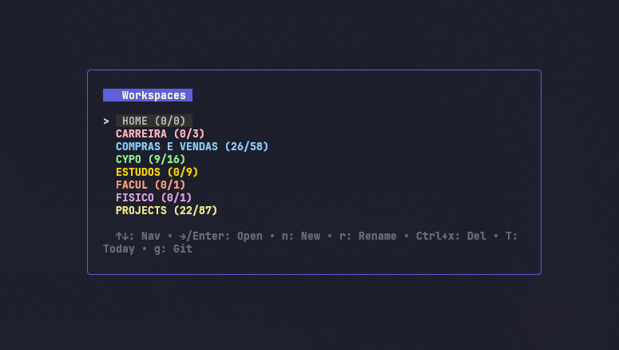

# 📝 MAU-toDoTUI

A minimalist yet powerful Terminal User Interface (TUI) for managing tasks, built with **Go**, **Bubble Tea**, and **Lip Gloss**.



## ✨ Features

- **🗂️ 4-Level Data Hierarchy**:
    - **Workspaces**: High-level directories (e.g., Work, Personal, Projects).
    - **Groups**: Custom files to categorize your task lists.
    - **Tasks**: Individual to-dos with detailed descriptions and metadata.
    - **Subtasks**: Break down complex tasks into easily manageable steps.
- **🌐 Smart Views & Virtual Groups**:
    - **"ALL" Group**: An aggregated view of every task across your current workspace.
    - **"FAVORITES" Group**: Track and pin your favorite groups (Toggle with `f`).
    - **Global "TODAY" View**: Press `T` from the workspaces view to instantly see all tasks marked for "Today" across all your workspaces.
- **📝 Rich Task Management**:
    - **Descriptions**: Add detailed multi-line notes or descriptions to tasks (`d`), previewable directly from the task list.
    - **Subtasks**: Create, reorder, and toggle individual subtasks for deeper organization.
    - **Custom Ordering**: Reorder workspaces, groups, tasks, and subtasks seamlessly using `Shift+Up` and `Shift+Down`.
- **💻 Integrated Git Console**:
    - Built-in console (`g`) allows you to run git commands (e.g., `git status`, `git commit`) directly within the TUI to transparently version control your task files.
- **🎨 Dynamic Theming & Views**:
    - Over 20+ distinct pastel and neon colors for various groups.
    - Borders and highlights dynamically match the active group's color.
    - Toggle between **Full Mode** (Bordered Window) and **Compact Mode** (Inline) instantly using `Tab`.
    - Smart sorting automatically floats active tasks to the top and sinks completed tasks to the bottom (dimmed).
- **🤖 AI Agent Integration** (OpenAI GPT-4o-mini):
    - **AI Chat Panel** (`a` from Task Details): Full-screen conversational AI assistant embedded in the TUI, with task-aware context.
    - **Proactive Analysis**: On first open, the AI automatically analyzes the task and asks clarifying questions if it's vague.
    - **Subtask Breakdown**: Ask the AI to break down a task into actionable subtasks — confirm and they're auto-created in the app.
    - **Step-by-Step Guidance**: The AI can walk you through a task one step at a time.
    - **Priority Recommendation** (`A` from Tasks List): AI analyzes all tasks in the group and recommends which to do first.
    - **Persistent Conversations**: Chat history is saved per task and persists across sessions.
    - **Fully Optional**: Works without AI — set `ai_enabled: false` or simply don't configure an API key.

---

## 🚀 Installation & Usage

### Prerequisites
- [Go](https://go.dev/dl/) installed.

### Run from Source
```bash
# Clone the repository
git clone https://github.com/mauvernaz/todoTUI.git
cd todoTUI

# Run directly
go run .

# Or build the executable
go build -o todo.exe
./todo.exe
```

### 🌍 Global Access (Recommended)
To run `todo` from anywhere, add the directory containing `todo.exe` to your system's **PATH**.

**Windows Users:**
1. Search for **"Edit environment variables for your account"**.
2. Select the `Path` variable and click **Edit**.
3. Click **New** and paste the full path to your `todoTUI` folder (e.g., `C:\Users\YourName\Documents\todoTUI`).
4. **Restart your terminal.** Now you can type `todo` from any folder!

---

## ⌨️ Controls

The application uses intuitive **Vim-style** navigation alongside standard Arrow keys.

### 🧭 Navigation & Views
| Key | Context | Action |
| :--- | :--- | :--- |
| **`Tab`** | Global | **Toggle View Mode** (Full Window / Compact) |
| **`←`** / **`h`** | Any | Go **Back** / Up a level (e.g., Tasks -> Groups) |
| **`→`** / **`l`** | Any | **Drill Down** / Enter selected item |
| **`Enter`** | Any | **Drill Down** (Groups, Tasks, Workspaces, Subtasks) |
| **`↑`** / **`k`** | Any | Move Cursor **Up** |
| **`↓`** / **`j`** | Any | Move Cursor **Down** |
| **`T`** | Workspaces | View Global **Today's Tasks** |
| **`g`** | Global | Open builtin **Git Console** |

### ⚡ Actions
| Key | Context | Action |
| :--- | :--- | :--- |
| **`n`** | Any | **New** (Workspace, Group, Task, Subtask) |
| **`r`** | Any | **Rename** Selected Item (or Subtask) |
| **`R`** | Task Details | **Rename Parent Task Title** (when highlighting subtasks) |
| **`d`** | Task Details | Add / Edit **Task Description** |
| **`f`** | Groups List | Toggle **Favorite** status for a Group |
| **`c`** | Groups List | **Randomize / Reroll Color** for a Group |
| **`t`** | Tasks List | Mark / Unmark Task for **Today** |
| **`A`** | Tasks List | **AI Priority Recommendation** (which task to do first) |
| **`S`** | Tasks List | **AI Task Scanner** (automatic suggestions for subtasks and renames) |
| **`a`** | Task Details | Open **AI Agent Panel** (chat with AI about this task) |
| **`C`** | Global | Open **Global AI Console (Omni-chat)** |
| **`Shift+↑`** / **`K`** | Any | **Move Item Up** (Reorder) |
| **`Shift+↓`** / **`J`** | Any | **Move Item Down** (Reorder) |
| **`Space`** | Tasks / Subtasks | **Toggle Done / Undone** |
| **`ctrl+x`** | Any | **Delete** Selected Item (or confirm deletion) |
| **`u`** | Any | **Undo (Rollback)** the last destructive action (Delete/Reorder) |
| **`Esc`** | Input / Detail / AI | **Cancel** Input / Return to previous view |
| **`q`** | Global | **Quit** Application |

---

## 💾 Data Persistence

Your data is automatically saved to clear, human-readable JSON files in an organized folder structure inside your user configuration directory:
- **Windows**: `C:\Users\%USERNAME%\AppData\Roaming\todotui\workspaces\`
- **Linux/Mac**: `~/.config/todotui/workspaces/`

Each workspace is a directory containing individual `.json` files for groups, along with a `meta.json` file storing your custom order preferences and favorite toggles. The structural simplicity makes it extremely easy to back up or version control via Git.

---

## 🤖 AI Configuration

The AI features are powered by OpenAI's API (defaulting to the lightweight and extremely fast `gpt-4o-mini`). To enable them:

### Option 1: Environment Variable
Set the environment variable in your terminal before launching the application:
- **Windows (PowerShell)**:
  ```powershell
  $env:OPENAI_API_KEY="sk-your-key-here"
  ```
- **Linux/Mac/Git Bash**:
  ```bash
  export OPENAI_API_KEY="sk-your-key-here"
  ```

### Option 2: Persistent Config File (Recommended)
Create a `config.json` file inside your user config directory:
- **Windows**: `C:\Users\<YourUsername>\AppData\Roaming\todotui\config.json` (or `%APPDATA%\todotui\config.json`)
- **Linux/Mac**: `~/.config/todotui/config.json`

File structure:
```json
{
  "openai_api_key": "sk-your-key-here",
  "openai_model": "gpt-4o-mini",
  "ai_enabled": true
}
```

If no API key is configured, pressing `a` or `A` shows a friendly error message inline, and the application remains 100% functional without AI features.

---

## 🧠 AI Agent & Productivity Companion

MAU-toDoTUI features an embedded AI assistant that acts as a proactive productivity companion directly inside the terminal. It features full contextual awareness and deep integration with your task database.

### 💬 Conversational Task Assistant (`a` from Task Details)
Pressing **`a`** while viewing any task's details opens a full-screen, custom-themed interactive AI panel. The AI is initialized with complete details about the workspace, current group, parent task title, description, and list of existing subtasks.

*   **Proactive Task Analysis**: On first open, the AI automatically analyzes the task. If the title is vague or lacks description, it will ask 2-3 target questions to clarify the scope. If the task is already clear, it provides a brief analysis and suggests next steps.
*   **Automated Subtask Breakdown & Database Sync**: You can ask the AI to break down your task into actionable subtasks. When the AI outputs proposed subtasks in the `[SUBTASKS]` block format, the application **automatically parses them** and offers you an interactive option to instantly inject them as live, functional subtasks in the app!
    *   *Example prompt*: "break this down into subtasks"
    *   *System flow*: The AI responds, and you simply type "sim" or "yes" to have them auto-created in your task database immediately.
*   **Step-by-Step Guidance**: Type "bora" or "começar" and the AI will guide you through the task one step at a time, keeping track of your progress.
*   **Persistent Task Conversations**: Chat history is saved per-task and persisted directly inside the task's JSON file. You can close the panel, close the app, and resume your exact conversation with the AI later.
*   **Navigation & Scrolling**: Use **`↑` / `↓`** arrows to scroll through long chat histories, **`Enter`** to send messages, and **`Esc`** to return to the task details view.

### 🎯 Smart Priority Recommendation (`A` from Tasks List)
Pressing **`A`** while viewing any group's task list triggers an overlay modal where the AI analyzes all tasks in the current group.
*   The AI evaluates completed vs. pending tasks, tasks marked for **Today**, title context, and description metadata.
*   It returns a concise 5-6 line recommendation in Portuguese proposing exactly which task to tackle first and the reasoning behind it (considering urgency, value, and dependencies).

### 🔍 AI Task Scanner (`S` from Tasks List)
Pressing **`S`** opens a scanner modal that reviews all incomplete tasks in your current group. The AI automatically acts as a productivity optimizer, suggesting directly actionable name changes or identifying which tasks critically need to be broken down into subtasks to avoid procrastination.

### 🌍 Global AI Console / Omni-chat (`C` from anywhere)
Pressing **`C`** instantly pauses the app and drops you into a Global Omni-chat overlay. The AI knows the exact context of where you are (which workspace and group you have open) and can assist you globally. Future updates will allow this console to directly execute commands in the app (like auto-adding tasks or modifying configurations) based on JSON actions returned by the AI.

### ↩️ Safety Rollback (`u`)
With AI capable of making powerful changes (and users accidentally hitting delete on huge task trees), pressing `u` instantly rolls back the task list to its state immediately before the last destructive change (like deletions, AI auto-confirmations, or reordering).


---

## 🛠️ Built With

- **Language**: [Go](https://go.dev/)
- **TUI Framework**: [Bubble Tea](https://github.com/charmbracelet/bubbletea)
- **Styling**: [Lip Gloss](https://github.com/charmbracelet/lipgloss)
- **Input Components**: [Bubbles](https://github.com/charmbracelet/bubbles)
- **AI**: [OpenAI API](https://platform.openai.com/) (GPT-4o-mini, via standard `net/http`)

---

## 📄 License

MIT License. Free to use and modify.

---

## 🐛 Changelog

- **Feature**: Added AI Scanner (`S`) for automated productivity recommendations on task lists.
- **Feature**: Added Global AI Console (`C`), an Omni-chat overlay that has global context of your workspaces.
- **Feature**: Added `u` Undo (Rollback) system for instant restoration after destructive changes like deletions or reordering.
- **Feature**: Added AI Agent integration with OpenAI GPT-4o-mini — chat panel (`a`), priority recommendations (`A`), subtask auto-creation, proactive task analysis, and persistent conversations per task.
- **Fix**: Corrected a critical data loss bug on Windows where renaming a workspace or group (specially applying only case changes) caused the original file to be overridden and then deleted immediately.
- **Fix**: Corrected a visual bug where completed tasks and subtasks became unreadable on certain terminal profiles by removing `Faint` styling and using a lighter gray color.
